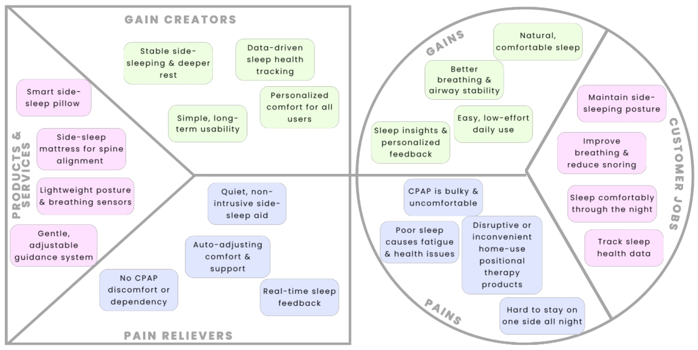
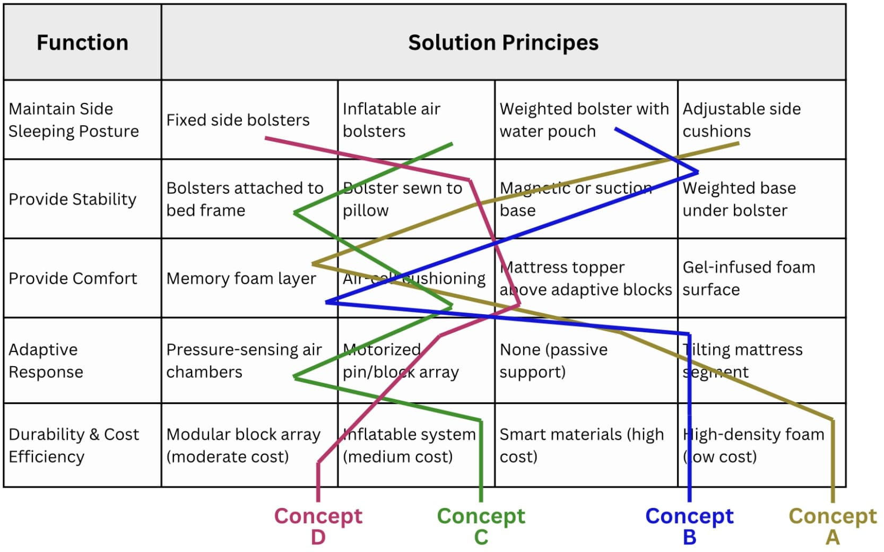

# Designing the Ultimate Anti-Snoring Pillow (Interim)

**Status:** In progress (Interim summary)  
**Focus:** A comfort-first side-sleeping support system for people with obstructive sleep apnea / snoring, designed to improve long-term adherence.

---

## Problem
Many existing sleep apnea solutions are effective but disruptive and uncomfortable, which contributes to poor adherence. We are exploring a more natural, user-centred intervention that supports consistent side-sleeping.

## Proposed direction (current concept)
A **hybrid side-sleeping smart support system** combining:
- **Weighted L-shaped bolster** (front “hug” pillow) to stabilise posture
- **Adaptive mattress contouring concept** to redistribute pressure and support alignment

## What we’ve done so far (interim)
- Reviewed current treatments and positional therapy approaches
- Conducted an exploratory sleep-position study using a wearable orientation sensor to understand real-world turning behaviour
- Generated multiple concepts and down-selected using a structured screening approach
- Defined measurable design requirements for comfort, posture stability, and non-intrusiveness

## Key design requirements (interim targets)
- Maintain side-sleeping for the majority of the night (target: ≥80%)
- Reduce discomfort/pressure points while supporting spinal alignment
- Avoid noisy or disruptive interventions; keep setup simple for home use

## Prototyping plan (next)
- Low-fidelity posture-support array to map support/contour needs across body profiles
- Thermal comfort testing of candidate material stacks (heat dissipation and overheating risk)
- Explore actuator/control approach for adaptive support (future phase)

## My role
- Drove research synthesis and translated user/clinical needs into design requirements
- Contributed to concept generation and screening (trade-offs: comfort, stability, feasibility)
- Supported interim prototyping plans and test design (posture + thermal comfort)
- Prepared interim documentation and presentation materials

---

## Media

